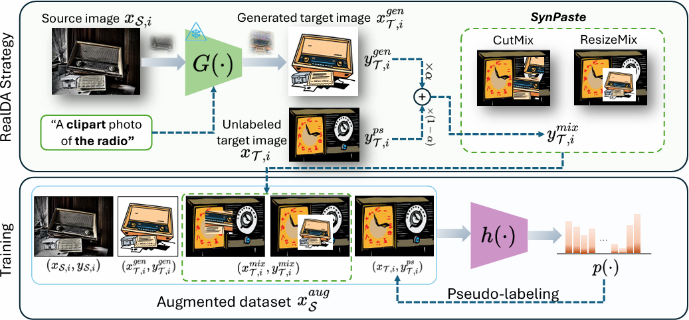

# RealDA: Bridging the Domain Gap with Realistic Synthesized Images for Unsupervised Domain Adaptation

By Ngo-Kien Duong, Doanh C. Bui, Ba Hung Ngo, and Tae Jong Choi.

- Manuscript: [manuscript.pdf](./resources/manuscript.pdf)
- Overview image: [overview.png](./resources/overview.png)

## Overview

RealDA is a plug-and-play Unsupervised Domain Adaptation (UDA) method that uses diffusion models to synthesize target-style images with reliable labels, then mixes them with real target images (SynPaste) to improve adaptation.



## Method Summary

From the manuscript, RealDA has two key ideas:

1. Prompted target-style synthesis
- Build prompts using target-domain definition and class labels.
- Resolve ambiguous classes using class mapping (for example, `mouse -> computer mouse`).
- Generate synthetic target-style images with Stable Diffusion.

2. SynPaste augmentation
- Mix generated images with real target images (CutMix/ResizeMix variants).
- Generate soft labels for mixed samples.
- Train jointly with source, generated, and mixed samples.

## Project Structure

```text
.
├── main.py
├── gen_image.py
├── configs/
│   ├── office_home.yaml
│   ├── office31.yaml
│   ├── domain_net.yaml
│   └── gen_image/
│       └── office_home_clipart.yaml
├── domain_prompt_configs/
│   └── office_home/
│       ├── art.json
│       ├── clipart.json
│       ├── product.json
│       └── real_world.json
├── resources/
│   ├── manuscript.pdf
│   └── overview.png
└── .env.example
```

## Installation

```bash
pip install -r requirements.txt
```

Create `.env` from `.env.example` and set your Hugging Face token:

```env
HF_TOKEN=your_huggingface_token_here
```

## Generate Synthetic Target Images

`gen_image.py` uses:
- `labels.txt` (one label per line)
- output path
- device
- number of images per class
- domain JSON config (`prompt_templates` + `class_mapping`)

Run with config file:

```bash
python gen_image.py -c configs/gen_image/office_home_clipart.yaml
```

Run with CLI arguments:

```bash
python gen_image.py ^
  --labels-file labels.txt ^
  --target-path .\generated_images\office_home\clipart ^
  --device cuda:0 ^
  --num-image-each-class 200 ^
  --domain-config .\domain_prompt_configs\office_home\clipart.json
```

Domain JSON format:

```json
{
  "domain": "clipart",
  "prompt_templates": [
    "clean clipart icon of {label}, plain background"
  ],
  "class_mapping": {
    "mouse": "computer mouse"
  }
}
```

## Train UDA Model

Expected dataset layout (ImageFolder style):

```text
data_dir/
  source_domain/
    class_1/*.jpg
    class_2/*.jpg
  target_domain/
    class_1/*.jpg
    class_2/*.jpg
```

Run training:

```bash
python main.py --config configs/office_home.yaml ^
  --data_dir <path_to_dataset_root> ^
  --src_domain Art ^
  --tgt_domain Clipart ^
  --gendata_dir <path_to_generated_target_images> ^
  --use_dapl --cutmix --cutmix_prob 1.0 --beta 1.0
```

## Acknowledgement

Thanks to [Wenlve-Zhou/VLP-UDA](https://github.com/Wenlve-Zhou/VLP-UDA.git).
